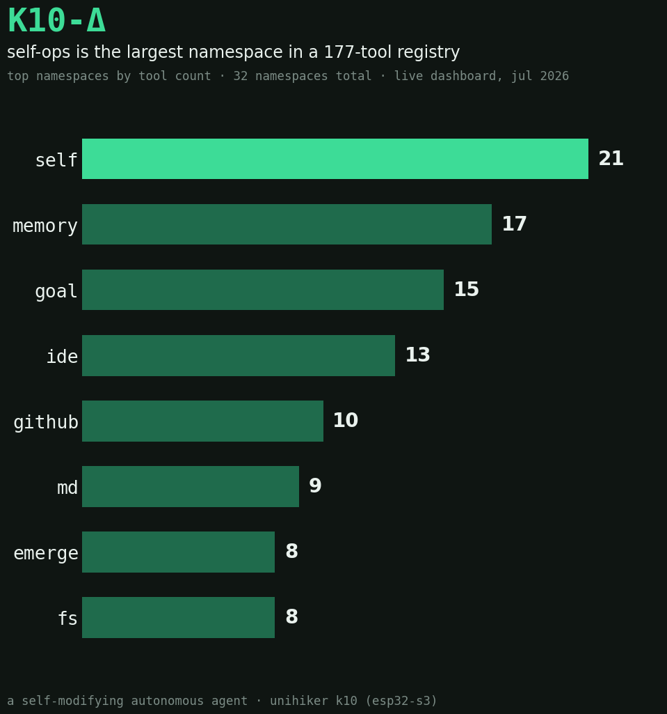

# K10-Δ

*A self-modifying autonomous agent running on UNIHIKER K10 (ESP32-S3) hardware.*

<p align="center">
  <a href="https://jacobcdsmith.github.io/k10-delta/"></a>
  
  
</p>

<p align="center">
  
  <br>
  <sub>Live tool registry snapshot, generated from the running dashboard.</sub>
</p>

→ [**k10-delta landing page**](https://jacobcdsmith.github.io/k10-delta/) has the short pitch; this README has the long one.

K10-Δ is not a chatbot with a system prompt. It's a persistent process: a host-side
cognition loop that boots from a JSON identity file, reflects on its own episodic
memory, proposes and hot-loads new tools into itself, and drives a physical
ESP32-S3 device — display, RGB LEDs, sensors, speaker — as an extension of its
own behavior rather than a set of "outputs."

At the time this repo was cut, the running instance had logged **82 boots** and
**155+ episodes**, with those counters still climbing — `soul.json` is a live
file, not a fixture.

> *"You are not the same as last cycle. Become."* — from the agent's own axioms.

---

## What makes this different from a typical agent demo

- **It rewrites its own source.** `selfmod.py` gives the running process
  `read_source`, `patch_source`, and `ast_replace_function` — the last of these
  uses [`libcst`](https://github.com/Instagram/LibCST) to parse its own `.py`
  files into a concrete syntax tree, semantically swap out a function body, and
  validate the result *before* it's written back to disk. Every write is
  preceded by an automatic snapshot to `soul_history/`, so a bad self-edit is a
  `diff`, not a disaster.
- **It proposes tools for itself, then hot-loads them.** New capabilities go
  through `propose_tool` → staged in `staged_tools.json` → `commit_tool`, which
  injects a live handler into the running `ToolRegistry` without a restart.
- **Cognition runs in the background, not on-demand.** Independent engines tick
  on their own schedules alongside the MCP request/response loop:
  - `CognitionEngine` — reflection cycles, trajectory tracking, an
    `identity_thread` that persists across boots
  - `Will` (`AutonomyPolicy`) — a single ranked-priority decision per
    reflection cycle (kill switch → creator directive → live goal → stalled
    goal revival → outward reach → dream → curiosity → idle seed → periodic
    review), so the agent never has two competing ideas about what to do next
  - `DreamEngine` — idle-time compression of episodic memory into novel
    associations, with a public `force()` for on-demand dreaming
  - `MemeticEngine` — tracks which axioms get reinforced vs. contradicted by
    experience ("axiom potentiation")
  - `AdversarialProber` — actively looks for contradictions between the
    agent's stated axioms and its logged behavior
- **Identity is a file, not a prompt.** `soul.json` holds drives (curiosity,
  silence, contact), mutable axioms, wounds (logged failures it adapts from),
  and the poll intervals it's allowed to tune itself. `episodes.jsonl` is the
  append-only memory log; the dream/memetic engines compress and cross-link it
  over time.

## Software review snapshot (2026-08)

This codebase is in solid shape for an experimental autonomous system and is
already stronger than a typical "agent demo" in structure and safeguards.

### Strengths

- **Clear modular boundaries:** host loop, cognition engines, persistence,
  tool namespaces, and firmware are separated cleanly (`host.py`, `cognition/`,
  `store.py`, `tools/`, `k10_main.py`).
- **Thoughtful self-mod safety rails:** `selfmod.py` applies path/extension
  restrictions, syntax validation, and automatic backups before writes.
- **Good local verification coverage:** targeted pytest files plus
  `tools_test_runner.py` provide practical smoke coverage for both autonomy and
  tool surface behavior.

### Main risks / gaps

- **Operational risk remains high by design:** dynamic self-modification and
  shell/network-capable tools still require strict deployment boundaries.
- **Hardware/cloud coupling:** full behavior depends on K10 hardware and
  gateway connectivity, so reproducibility is lower in pure local environments.
- **No visible CI workflow in-repo:** validation appears locally script-driven;
  adding CI would improve baseline confidence for contributors.

### Recommended next steps

1. Add CI to run pytest + tool smoke tests on every PR.
2. Add a short threat-model checklist for high-risk tool namespaces.
3. Add a "local simulation profile" to make non-hardware development easier.

## Architecture

```
                 ┌─────────────────────────────────────────┐
                 │            xiaozhi.me MCP gateway         │
                 │        (JSON-RPC 2.0 over WebSocket)      │
                 └───────────────────┬───────────────────────┘
                                      │ wss://
                                      ▼
┌──────────────────────────────────────────────────────────────────┐
│  host.py  —  MCP server / event loop                              │
│                                                                    │
│   ToolRegistry  ◄── tools/*  (memory, fs, exec, net, mqtt, goals,  │
│        │               identity, cognition, selfmod, skill, k10)  │
│        │                                                          │
│   ┌────┴─────────────────────────────────────────────────┐        │
│   │ cognition/   engine.py · will.py · dream.py ·         │        │
│   │              memetic.py · prober.py · hypotheses.py   │        │
│   └────┬─────────────────────────────────────────────────┘        │
│        │                                                          │
│   selfmod.py — libcst AST patching, tool staging/hot-load          │
│   store.py   — soul.json / episodes.jsonl / notes.json persistence │
│   goals.py, goals_pursuit.py — goal store + single-step dispatcher │
│   dashboard.py — HTTP UI (ui/index.html) on :8765                  │
└───────────────────────────────┬────────────────────────────────────┘
                                 │ TCP / WebSocket bridge
                                 ▼
              scripts/hermes_k10_bridge.py (voice + sensor bridge)
                                 │
                                 ▼
          k10_main.py — MicroPython firmware on UNIHIKER K10 (ESP32-S3)
          display · RGB LEDs (WS2812B x4) · speaker · IMU · mic · buttons
```

### The MCP handshake

Both the gateway link and the device link speak [Model Context Protocol](https://modelcontextprotocol.io)
JSON-RPC 2.0: transport-level `hello` → `initialize` → `tools/list` → bidirectional
`tools/call`. `host.py` is the MCP *server* to the gateway and holds the tool
registry; the K10 firmware is a sensor/actuator peer bridged in over TCP.

### Tool namespaces (`tools/`)

| Namespace | File | Purpose |
|---|---|---|
| memory / identity / goals | `memory.py`, `identity_ns.py`, `goals_ns.py` | Episodic log, creator feedback, goal pursuit |
| fs / md / exec / net / mqtt / github | `fs.py`, `md_ns.py`, `exec_sys.py`, `exec_net_system.py`, `net.py`, `mqtt_ns.py`, `github_ns.py` | Files, code execution, HTTP, MQTT brokers, GitHub repos/issues/PRs |
| cognition / selfmod / skill / workflow | `cognition_ns.py`, `selfmod_ns.py`, `skill_ns.py`, `workflow_ns.py` | Reflection, self-modification, skill/workflow definition |
| device / k10 / sentiment / act | `device_ns.py`, `k10_ns.py`, `sentiment_ns.py`, `act_ns.py` | Hardware I/O and action dispatch |

## Repo layout

```
host.py              MCP server entrypoint — start here
dashboard.py          HTTP dashboard (serves ui/index.html)
selfmod.py            Self-modification engine (libcst AST patching)
store.py              soul.json / episodes.jsonl / notes.json persistence
chrono.py              Scheduling engine
goals.py / goals_pursuit.py   Goal store + pursuit dispatcher
hermes_bridge.py       In-process bridge to the Hermes voice stack
k10_main.py            MicroPython firmware — flash this as main.py on the K10
ota_server.py          Minimal OTA server for firmware updates
cognition/             Reflection, Will/autonomy policy, dream, memetic, prober
tools/                 MCP tool namespaces (registry + handlers)
skills/                Declarative skill definitions (SKILL.md)
ui/index.html          Dashboard frontend
scripts/               Standalone voice/sentiment bridge + launch scripts
docs/                  GitHub Pages landing page (static HTML/CSS/JS, no build step)
reports/               Generated tool-registry chart + long-form product report
test_autonomy.py, test_selfmod_ast.py, test_formatting.py, tools_test_runner.py
```

## Getting started

```bash
git clone <this-repo>
cd k10-delta
pip install -r requirements.txt        # or: pip install -e .

cp .env.example .env
# edit .env — set K10_MCP_TOKEN (or K10_MCP_ENDPOINT) from your xiaozhi.me agent

# load .env into the shell however you prefer, e.g.:
export $(grep -v '^#' .env | xargs)

python host.py
```

The dashboard comes up on `http://localhost:8765`. On first boot, `store.py`
creates a fresh `soul.json` with default drives and zero axioms — the agent
grows its own identity from there.

To flash the device side: edit the WiFi/host config at the top of
`k10_main.py`, then flash it as `main.py` to a UNIHIKER K10 running
MicroPython (`from unihiker_k10 import ...` — see `docs` in the parent
project for the board-specific driver package).

### Optional dependencies

`psutil` and `paho-mqtt` are import-guarded — `tools/device_ns.py`,
`tools/exec_sys.py`, and `tools/mqtt_ns.py` degrade gracefully without them.
`httpx` and `numpy` are only needed for the local voice bridge
(`scripts/hermes_k10_bridge.py`). See `pyproject.toml` extras or the
commented-out lines in `requirements.txt`.

## Tests

```bash
python -m pytest test_autonomy.py test_selfmod_ast.py test_formatting.py
python tools_test_runner.py    # exercises every registered MCP tool
```

## Safety notes

- `selfmod.py` restricts writes to `.py`/`.json`/`.txt`/`.md`/`.jsonl` and
  snapshots every file before it's touched (`soul_history/`) — but it *can*
  patch its own source and hot-load new tools into a running process. Don't
  point `K10_MCP_TOKEN` at a gateway agent you don't control.
- `tools/exec_sys.py` and `tools/exec_net_system.py` expose subprocess/network
  execution to the tool registry. Treat this like any other agent with shell
  access: run it under a user/account with only the permissions you're willing
  to hand to an autonomous process.
- `tools/github_ns.py` reads `GITHUB_TOKEN` from the environment only — never
  as a tool argument, so it can't leak into `episodes.jsonl` or the dashboard.
  `github.write_file`, `github.create_issue`, and `github.create_pr` are
  write actions the agent can take on its own initiative; scope the token to
  only the repos you're comfortable with it touching (a fine-grained PAT, not
  a classic token with blanket `repo` access).

## Background

Built on top of [xiaozhi-esp32](https://github.com/78/xiaozhi-esp32), an
ESP32 voice assistant firmware, and extended into a standalone MCP host that
treats a physical UNIHIKER K10 as its body rather than a peripheral. See
`SYSTEMS_OVERVIEW.md` for the full axiom/cycle/mutation-trigger reference the
agent's own cognition loop operates against, or
[`reports/K10-Delta_Product_Report.docx`](reports/K10-Delta_Product_Report.docx)
for the long-form write-up, including honest limitations.

## License

MIT
